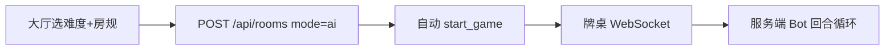
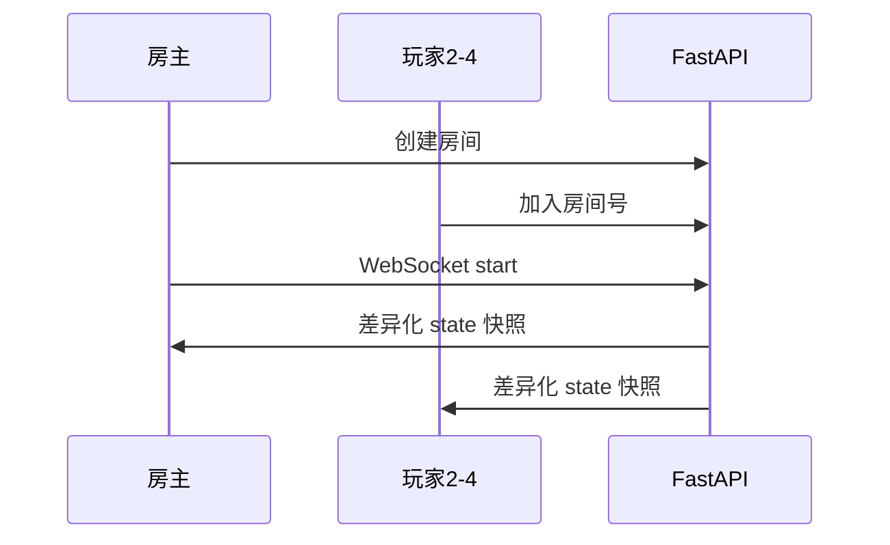
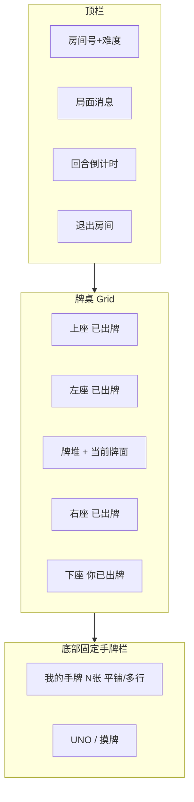
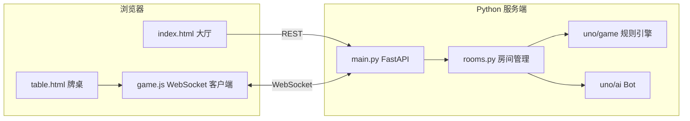
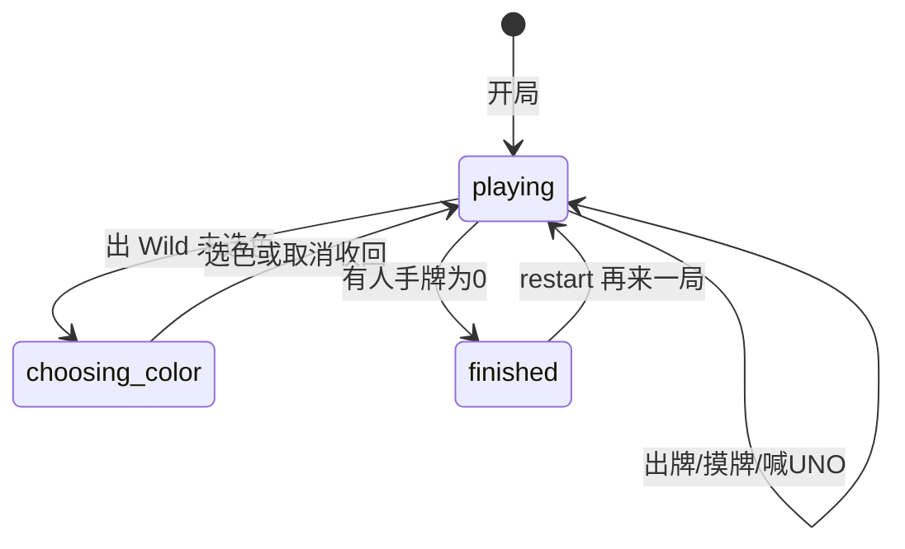

# UNO 四人对战 — 产品设计文档（v1.0 已交付）

## 1. 产品概述

### 1.1 定位

浏览器即开即玩的 **固定 4 人 UNO**，Python 服务端权威校验，支持：

- **单人 vs AI**：1 人类 + 3 Bot，创建房间即开局
- **在线联机**：4 位房间号加入，房主满员后开始

### 1.2 目标用户

- 想快速开一局 UNO 的朋友（本地或远程）
- 练习 UNO 规则、与不同难度 AI 对战

### 1.3 技术原则

- **逻辑 100% 在 Python**（[`uno/game/`](uno/game/)），前端只渲染与发意图
- **服务端权威 `GameState`**，防作弊
- **同一套 UI + 规则引擎** 服务 AI 与联机两种模式

---

## 2. 核心玩法与规则

### 2.1 经典 UNO（已实现）

| 规则 | 实现 |
|------|------|
| 牌组 | 108 张（[`uno/game/deck.py`](uno/game/deck.py)） |
| 发牌 | 每人 7 张 |
| 首张翻牌 | 非 Wild 生效；Wild 重洗 |
| 出牌 | 匹配颜色 / 数字 / 功能牌；+4 仅当无同色牌 |
| 摸牌 | 无牌可出时摸 1 张；有 pending +2 时摸累积张数 |
| 特殊牌 | Skip、Reverse、+2、Wild、+4 |
| 胜利 | 手牌为 0 |
| 牌堆空 | 弃牌堆（留顶牌）洗回 |

### 2.2 房规（创建房间时配置，存于 `RoomRules`）

| 房规 | UI | 默认 | 说明 |
|------|-----|------|------|
| UNO 惩罚 | ON/OFF 开关 | **ON** | 剩 1 张未喊 UNO，回合结束罚摸 2 张 |
| +2 叠 +2 | ON/OFF 开关 | **OFF** | 开启后遇 +2 可出 +2 转嫁，否则摸累积张数 |
| 回合超时 | 数字输入 | **30s** | 轮到你超时自动摸牌并结束回合 |

房规入口：大厅 → **房规设置** ▼

### 2.3 未实现（后续可选）

- +4 叠 +4、+4 质疑
- 联机断线超 60s 自动 Bot 代打（当前：离开房间时若轮到你则自动摸牌）

---

## 3. 游戏模式

### 3.1 单人 vs AI



- 座位 0 为人类（屏幕下方），1–3 为 Bot
- **AI 难度**（创建前选择，整局不变）：

| 难度 | 行为 |
|------|------|
| **简单** | 出牌较随机；常忘记喊 UNO；+2 叠牌时可能选错 |
| **普通** | 优先功能牌、保留 Wild、按手牌选色 |
| **困难** | 对少牌对手用 Skip/+2；保留 Wild 至关键时刻；会叠 +2；几乎不漏 UNO |

- 牌桌顶栏显示：`房间 XXXX · 难度 困难`

### 3.2 在线联机



- 房主创建 → 分享 4 位 **房间号**
- 未满员前显示 **等待玩家** 遮罩（房间号、已加入列表、房主「开始游戏」）
- 等待页提供 **取消** 按钮：确认后调用 `POST /api/rooms/leave` 并返回首页，避免一直卡在等待界面
- 满 4 人 → 房主点 **开始游戏**
- 每人仅见 **自己的手牌**；他人只见张数、UNO 状态、已出牌区
- **断线重连**：`localStorage` 存 `player_token`，同 URL 重进恢复

### 3.3 再来一局

- 对局结束弹窗：**再来一局** / **返回大厅**
- vs AI：人类可重开
- 联机：**仅房主**可重开；其他人见「等待房主再来一局」
- 同房间、同玩家、同房规与 AI 难度，重新发牌

### 3.4 退出房间

- 牌桌右上角 **退出房间** → 确认 → 回大厅
- 联机 **等待玩家** 遮罩内 **取消** → 确认「确定取消并返回大厅？」→ 同上离开流程
- vs AI：销毁房间
- 联机未开局：移除座位；房主离开则 **转移房主**；最后一人离开则 **销毁房间**
- 游戏中离开：若轮到你则 **自动摸牌** 后移除

---

## 4. 牌桌 UI 设计（已实现）

### 4.1 布局



- **视角**：你在下方；上 / 左 / 右为其他玩家（相对旋转）
- **中央**：左侧 **牌堆**（可点击摸牌），右侧 **当前牌面** + 颜色指示圆点
- **面前出牌区**：每座 **「已出牌」** 标签 + 最近 3 张（缩小、虚线、「已出」标记）
- **手牌底栏**：固定屏幕底部，**不重叠平铺**；8+ 张缩小，12+ 更小，16+ 最小；可多行滚动

### 4.2 手牌与出牌视觉区分

| 区域 | 样式 |
|------|------|
| **我的手牌** | 金色边框底栏；完整牌面；可出牌 **绿色描边** |
| **不可出** | 半透明发灰 |
| **已出牌区** | 小牌、虚线框、偏灰、「已出」角标 |
| **当前牌面** | 略放大、白边强调 |

### 4.3 交互

| 操作 | 说明 |
|------|------|
| 点击手牌 | 出牌（Wild 先弹选色） |
| 摸牌 / 点牌堆 | 发送 `draw` |
| UNO! | 剩 ≤2 张时可喊 |
| Wild 选色 | 四色按钮；**取消** / Esc / 点遮罩 可撤回 |
| 当前回合 | 座位金色高亮 + 顶栏倒计时 |
| pending +2 | 顶栏提示「须摸 N 张（可出 +2 叠加）」 |

### 4.4 联机等待遮罩（`#lobby-overlay`）

```
┌─────────────────────────┐
│      等待玩家            │
│  房间号: 1234            │
│  座位 1: Alice           │
│  座位 2: Bob             │
│  …                       │
│  [ 开始游戏（4 人已到齐）] │  ← 仅房主且满员可见
│  [ 取消 ]                │  ← 任意等待中玩家可点
└─────────────────────────┘
```

- 由 WebSocket `lobby` 消息驱动 `renderLobby()`
- **取消** 复用 `leaveRoom()`：断开 WebSocket、清 `localStorage` token、跳转 `/`

---

## 5. 大厅 UI 设计（已实现）

```
┌─────────────────────────────────┐
│         UNO 四人对战             │
│  昵称 [________]                 │
│  AI 难度  [简单][普通*][困难]     │
│  [ 单人 vs AI ]                  │
│  ── 创建在线房间 ── [创建]        │
│  ── 加入房间 ── [号][加入]        │
│  房规设置 ▼                      │
│    UNO 惩罚      [ON/OFF 小开关]  │
│    +2 叠 +2      [ON/OFF 小开关]  │
│    回合超时(秒)  [30]            │
└─────────────────────────────────┘
```

- 房规为 **滑动式 ON/OFF 小开关**（非整行大按钮）
- vs AI 携带 `ai_difficulty`；联机不传难度

---

## 6. 系统架构



### 6.1 目录结构（当前）

```
uno/
├── pyproject.toml / requirements.txt / Dockerfile / README.md
├── uno/
│   ├── game/          models, deck, engine, rules
│   ├── ai/            bot.py（三档难度）
│   ├── server/        main.py, rooms.py
│   ├── static/        css/table.css, js/game.js
│   └── templates/     index.html, table.html
└── tests/             deck, engine, bot, restart, leave, difficulty（23 项）
```

### 6.2 权威状态与快照

- 服务端 [`Room.game`](uno/server/rooms.py) 持有 `GameState`
- `build_snapshot(viewer_id)` 按观众裁剪：
  - `you.hand`：完整手牌
  - `others`：仅 `hand_count`、UNO、已出牌区
  - `legal_moves`：仅当前人类玩家
- Bot 回合：`_run_bot_turns` + 房间级 **asyncio 锁**，防并发；失败兜底摸牌

---

## 7. API 与 WebSocket 协议

### 7.1 REST

| 方法 | 路径 | 说明 |
|------|------|------|
| GET | `/` | 大厅页 |
| GET | `/table/{room_id}` | 牌桌页 |
| POST | `/api/rooms` | 创建房间（mode, 房规, ai_difficulty） |
| POST | `/api/rooms/join` | 加入联机房间 |
| POST | `/api/rooms/leave` | 退出房间 |

### 7.2 WebSocket ` /ws/{room_id}?token=...`

**客户端 → 服务端**

| action | 字段 | 说明 |
|--------|------|------|
| `play` | card_id, chosen_color? | 出牌 |
| `draw` | — | 摸牌 |
| `call_uno` | — | 喊 UNO |
| `choose_color` | color | Wild 选色 |
| `cancel_color` | — | 取消 Wild 选色（牌收回） |
| `start` | — | 联机房主开始 |
| `restart` | — | 再来一局 |
| `leave` | — | 退出 |
| `ping` | — | 心跳 |

**服务端 → 客户端**

| type | 说明 |
|------|------|
| `state` | 对局快照（含 table, you, others, legal_moves, can_restart） |
| `lobby` | 联机等待大厅 |
| `left` | 已退出 |
| `error` | 操作失败原因 |
| `pong` | 心跳响应 |

---

## 8. 回合状态机



---

## 9. 测试与质量

- **pytest 23 项**：牌组、引擎、Bot、+2 叠 +2、选色取消、再来一局、退出房间、AI 难度
- **Bot 修复记录**：剩 1 张不再反复喊 UNO 卡住；Bot 回合锁防竞态

---

## 10. 部署

```bash
cd uno
pip install -r requirements.txt
PYTHONPATH=. uvicorn uno.server.main:app --host 0.0.0.0 --port 8000
```

Docker：

```bash
docker build -t uno-game .
docker run -p 8000:8000 uno-game
```

- 单进程 uvicorn 同时提供静态资源、HTTP、WebSocket
- 房间数据当前 **内存**；重启服务房间丢失

---

## 11. 风险与合规

- **商标**：UNO 为 Mattel 商标；学习/个人项目可接受，商用需授权
- **联机作弊**：必须服务端 `apply_move` 校验
- **扩展性**：多实例部署需 Redis 等共享房间状态（未做）

---

## 12. 后续路线图（未做）

1. +4 叠 +4、质疑房规
2. 联机断线托管 Bot（非主动离开）
3. Redis 房间持久化 / 观战
4. 牌面 SVG 素材、音效
5. 可选 pygame 桌面客户端（共用 `uno/game/`）

---

## 13. 决策记录

| 日期/阶段 | 决策 |
|-----------|------|
| 初版 | React → **Python + FastAPI**；浏览器 Jinja2 + vanilla JS |
| 布局 | 手牌 **底部固定栏**；平铺可见，取消重度重叠扇形 |
| 房规 UI |  checkbox → **ON/OFF 小滑动开关** |
| AI | 三档难度；简单/普通/困难 不同策略 |
| 联机重开 | 仅房主；AI 模式人类可重开 |
| 等待取消 | 联机等待遮罩增加 **取消** 按钮，避免无法返回大厅 |

---

## 14. Node 实现说明（POLYBOX 集成）

本仓库已按 POLYBOX 产品矩阵用 **Node.js** 重新实现（非 Python 原版）：

| 组件 | 路径 |
|------|------|
| 规则引擎 | [`games/uno/engine/`](../games/uno/engine/) |
| 房间 API | [`shared/uno-rooms.mjs`](../shared/uno-rooms.mjs) + `server.mjs` `/api/uno/*` |
| 大厅 / 牌桌 | [`games/uno/index.html`](../games/uno/index.html)、[`table.html`](../games/uno/table.html) |
| 入口 URL | `/uno.html`、`/uno-table.html` |

- 持久化：本地 `data/minimaths.db`；线上 Turso 表 `uno_rooms`、`uno_players`
- 同步：**step 模式** — 每次 API 最多推进一个 Bot 动作，客户端 REST 轮询 + 飞牌动画（本地/云端同一套协议，无 WebSocket）
- 轮询：Bot 回合 ~700ms，己方 ~1.8–2.2s（见 `games/uno/uno-runtime.js`）
- 测试：`npm run test:uno`
